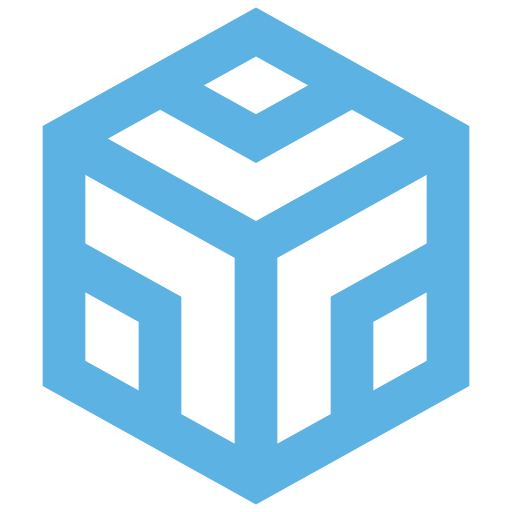
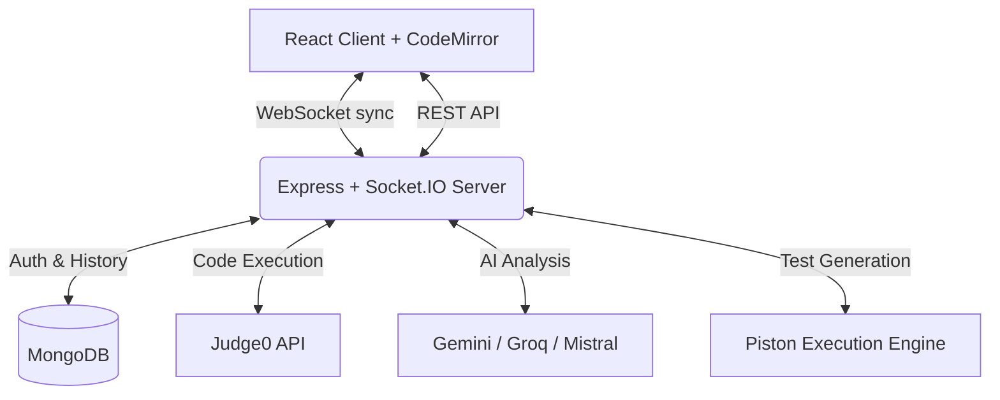
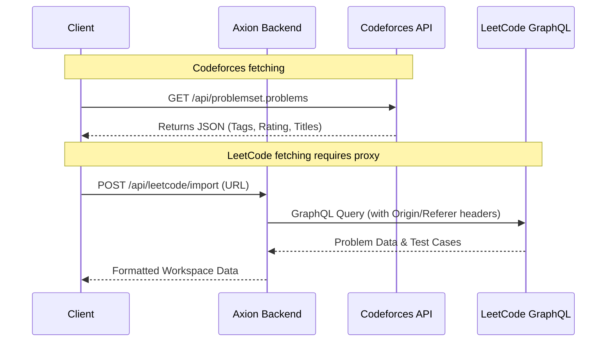

<div align="center">
  <a href="https://axion-workspace.vercel.app">
    
  </a>
</div>

# Axion

### One shared room for DSA practice, mock interviews, and mentoring.

[](LICENSE)
[](https://nodejs.org/)
[](https://react.dev/)
[](https://socket.io/)

**[Quick Start](#quick-start)** | **[Features](#features)** | **[Architecture & APIs](#architecture--api-integration)** | **[Roadmap](#roadmap-snapshot)**

</div>

---

## What is Axion?

Axion is a high-performance, real-time collaborative workspace designed for interview-style problem solving and competitive programming practice.

Instead of splitting a practice session across a video call, a shared notes document, a local compiler, and a separate code review tool, Axion unifies the entire workflow. It provides a synchronized problem brief, shared code editor, hidden test generation, AI-powered solution analysis, and session reporting—all in one focused room.

It is intentionally narrow: **one problem, one shared solution, one focused workflow.**

---

## Features

### ⚡ Real-Time Collaboration
- **Shared Workspace:** Room-based coding powered by Socket.IO with sub-millisecond sync.
- **Presence & Roles:** Live participant cursors, highlighting, and Driver/Navigator role assignments.
- **Session Modes:** Tailor the UI for `Peer Practice`, `Mock Interview`, or `Mentoring`.
- **Synchronized Execution:** Shared run results so both users can debug the exact same execution outcome simultaneously.

### 🎯 Interview Workflow
- **Integrated Problem Briefs:** Shared prompt, constraints, notes, and sample I/O.
- **Problem Import Helpers:** Import directly from Codeforces or LeetCode.
- **Edge-Case Checklist:** Interview-style validation lists to ensure robust logic.
- **Built-in Timers:** Strict timed practice blocks for mock interview simulations.

### 🧪 Execution & Testing
- **Multi-Language Support:** Run C++, Python, and JavaScript seamlessly.
- **Judge0 Engine:** Reliable standard code execution.
- **Hidden Test Generation:** AI-assisted generation of verified and stress tests based on the problem statement.
- **Output Diffing:** Visual expected vs. actual sample output comparisons.

### 📊 Analysis & Reports
- **AI Solution Review:** Get instant feedback on time/space complexity, bug risks, and optimization suggestions.
- **Session Intelligence:** End-of-session reports detailing strengths, logical gaps, next steps, and an overall session score.
- **Shareable Assets:** Generate downloadable session cards and shareable analysis links for your portfolio or mentor.

---

## Architecture & API Integration

Axion uses a client-server architecture to manage real-time state, execute untrusted code safely, and route AI/Problem data.

### System Flowchart



### External Problem APIs

Axion integrates with major competitive programming platforms to pull problem data directly into the workspace. Because of differing security configurations on these platforms, the data retrieval is handled in two distinct ways:

#### 1. Codeforces API (Client-Side / Cached)
Axion utilizes the public Codeforces API endpoint (`https://codeforces.com/api/problemset.problems`) to provide a browsable catalog.
*   **What it provides:** A comprehensive JSON object containing Contest IDs, Problem Indices (for linking), Problem Names, Tags (e.g., "dp", "greedy"), and Difficulty Ratings.
*   **How it works:** Because Codeforces allows cross-origin requests, this data can be fetched and filtered swiftly. Axion caches this catalog to allow users to search by tags and ratings instantly.

#### 2. LeetCode GraphQL (Server-Side Proxy)
Unlike Codeforces, `leetcode.com/graphql` **does not allow browser CORS**.
*   **How it works:** To bypass browser restrictions, Axion routes LeetCode imports through the Node.js backend. The Express controller acts as a proxy, attaching the necessary `Referer` and `Origin` headers that LeetCode's endpoint requires, securely parsing the problem statement, and delivering it back to the shared room.



---

## Tech Stack

| Layer | Technology |
| --- | --- |
| **Frontend** | React 18, Vite, Tailwind CSS, Recharts |
| **Editor** | CodeMirror 6 |
| **Realtime** | Socket.IO |
| **Backend** | Node.js, Express |
| **Database** | MongoDB / Mongoose (Auth & History) |
| **AI Integration** | Gemini (Primary), Groq, Mistral |
| **Code Execution** | Judge0 (Standard runs), Piston (Hidden tests) |

---

## Quick Start

### Prerequisites
- Node.js 18+
- MongoDB (Local or Atlas Atlas cluster)
- RapidAPI Key (for Judge0 CE)
- Gemini API Key (for AI Analysis)

### 1. Install dependencies
```bash
# Install root dependencies
npm install
```

### 2. Configure environment
Create a `.env` file in the **root** directory:
```env
VITE_SERVER_URL=http://localhost:5001
```

Create a `.env` file in the **`server/`** directory:
```env
PORT=5001
CLIENT_URL=http://localhost:5173

APP_NAME=Axion
APP_URL=http://localhost:5173

JUDGE0_API_URL=[https://judge0-ce.p.rapidapi.com](https://judge0-ce.p.rapidapi.com)
JUDGE0_API_KEY=your_rapidapi_judge0_key_here

GEMINI_API_KEY=your_gemini_key_here

JWT_SECRET=your_secure_random_string
MONGODB_URI=mongodb://localhost:27017/axion
```

### 3. Start the Application
Run these commands in separate terminal windows:

```bash
# Terminal 1: Start the backend server
npm run dev:server

# Terminal 2: Start the Vite frontend
npm run dev:client
```
Open `http://localhost:5173` in your browser.

---

## Project Structure

```text
Axion/
|-- src/
|   |-- components/
|   |   |-- Workspace/
|   |   |-- codeforces/
|   |   |-- common/
|   |   |-- sessionIntelligence/
|   |   `-- sidebar/
|   |-- lib/
|   |-- pages/
|   `-- socket.js
|-- server/
|   |-- data/
|   |-- hidden-tests/
|   |-- models/
|   |-- services/
|   |-- ai-server.js
|   `-- server.js
|-- public/
`-- README.md
```

---

## Known Boundaries

Axion is intentionally **not**:
- a multi-file IDE (e.g., VS Code)
- a direct clone of LeetCode
- a generic compiler playground

It is highly optimized for **collaborative problem-solving sessions** around a single data structure or algorithmic challenge.

---

## License

MIT - see [LICENSE](LICENSE).
